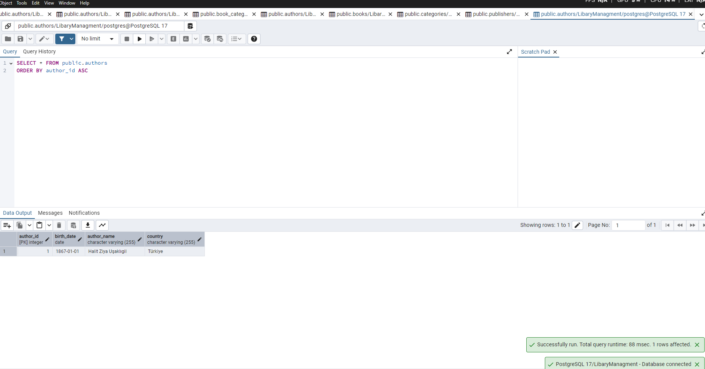
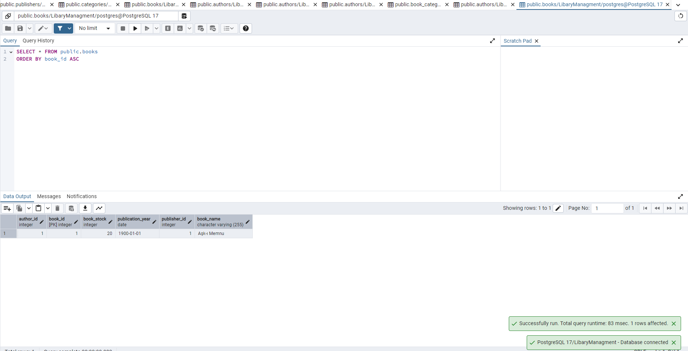
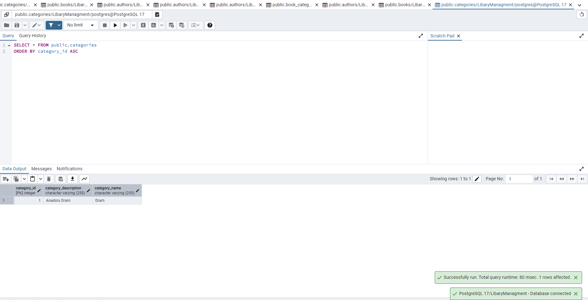
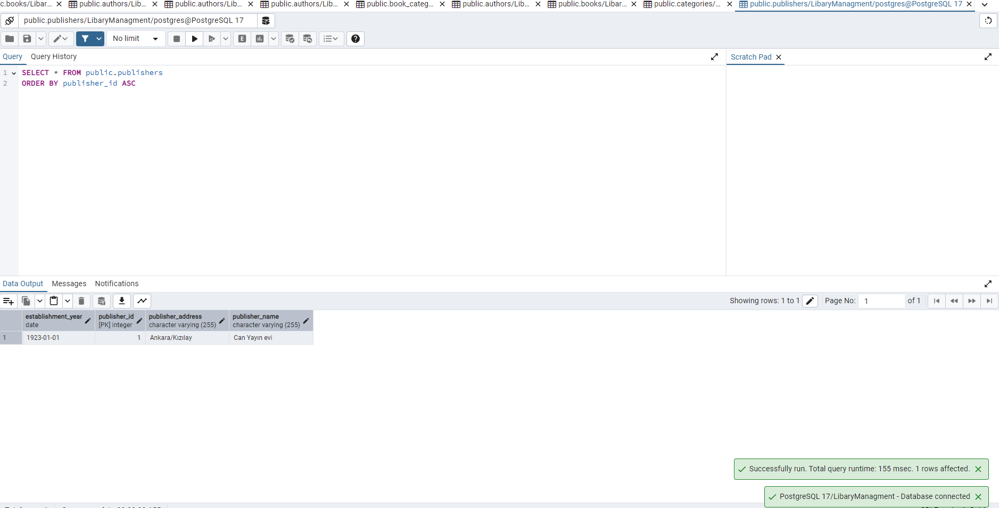
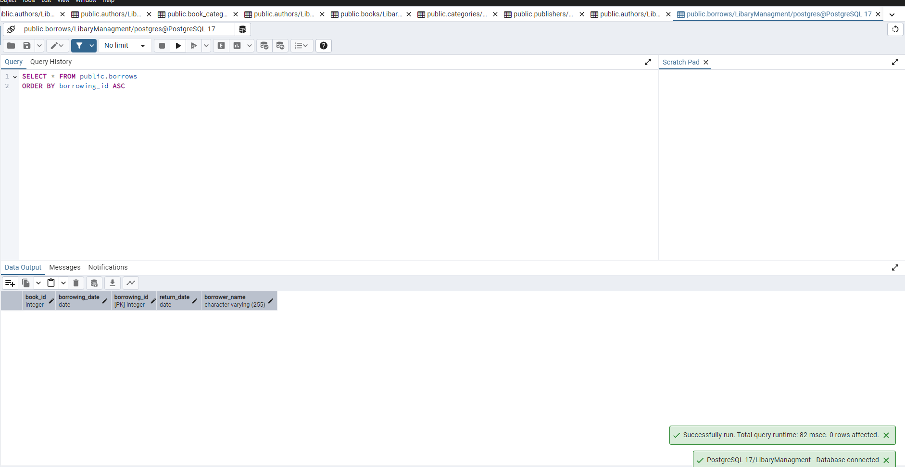
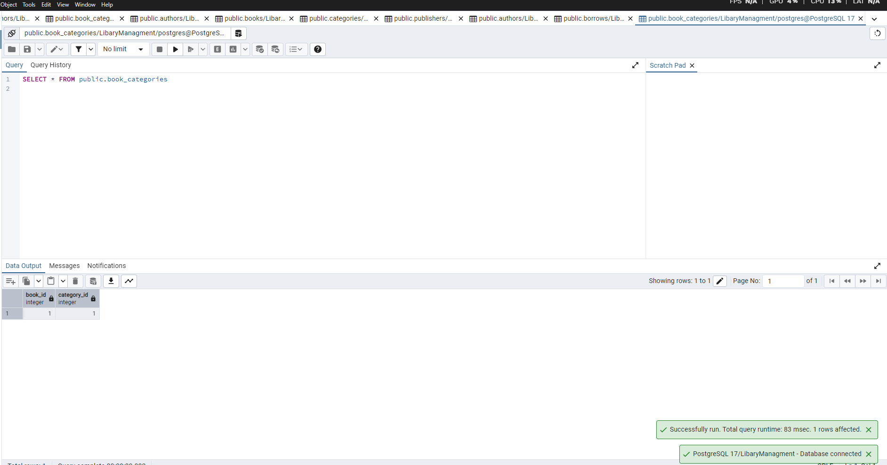

# Kütüphane Yönetim Sistemi

Bu proje, Java, Maven, Hibernate ve PostgreSQL kullanarak geliştirilmiş basit bir kütüphane yönetim sisteminin varlık (entity) katmanını ve veritabanı ilişkilerini göstermektedir.

## Proje Amacı

Projenin temel amacı, bir kütüphane ortamında bulunan farklı varlıkları (Kitap, Yazar, Kategori, Yayın Evi, Kitap Ödünç Alma) modellemek ve bu varlıklar arasındaki ilişkileri JPA (Java Persistence API) anotasyonları ile tanımlayarak bir PostgreSQL veritabanında persist (kalıcı hale getirme) etmektir.

## Kullanılan Teknolojiler

* **Java**: Uygulamanın temel programlama dili.
* **Maven**: Proje yönetimi ve bağımlılık yönetimi aracı.
* **Hibernate ORM**: JPA referans implementasyonu olarak veritabanı işlemleri için kullanılan ORM (Object-Relational Mapping) aracı.
* **PostgreSQL**: İlişkisel veritabanı yönetim sistemi.

## Varlıklar (Entities) ve İlişkileri

Projede tanımlanan başlıca varlıklar ve aralarındaki ilişkiler aşağıda belirtilmiştir:

* **`Author` (Yazar)**
    * Bir yazarın birden fazla kitabı olabilir. (`@OneToMany` ile `Book` ilişkisi)
* **`Book` (Kitap)**
    * Bir kitabın bir yazarı vardır. (`@ManyToOne` ile `Author` ilişkisi)
    * Bir kitabın bir yayınevi vardır. (`@ManyToOne` ile `Publisher` ilişkisi)
    * Bir kitap birden fazla kategoriye ait olabilir. (`@ManyToMany` ile `Category` ilişkisi)
    * Bir kitap birden fazla ödünç alma işlemine sahip olabilir. (`@OneToMany` ile `BookBorrowing` ilişkisi)
* **`Category` (Kategori)**
    * Bir kategori birden fazla kitaba sahip olabilir. (`@ManyToMany` ile `Book` ilişkisi)
* **`Publisher` (Yayın Evi)**
    * Bir yayınevinin birden fazla kitabı olabilir. (`@OneToMany` ile `Book` ilişkisi)
* **`BookBorrowing` (Kitap Ödünç Alma)**
    * Her ödünç alma işlemi yalnızca bir kitaba aittir. (`@ManyToOne` ile `Book` ilişkisi)

## Veritabanı Şeması ve Veriler

Uygulama çalıştırıldığında PostgreSQL veritabanında otomatik olarak oluşturulan tablolar ve örnek veriler aşağıda gösterilmiştir.

### Authors Tablosu

### Books Tablosu

### Categories Tablosu

### Publishers Tablosu

### Borrows Tablosu

### book_categories Tablosu (Ara Tablo)

---

## Kurulum ve Çalıştırma

1.  Projenin kaynak kodunu klonlayın veya indirin.
2.  Maven bağımlılıklarını yüklemek için `pom.xml` dosyasını kullanın.
3.  `src/main/resources/META-INF/persistence.xml` dosyasındaki PostgreSQL bağlantı ayarlarını kendi veritabanı bilgilerinize göre güncelleyin.
4.  `Main.java` sınıfını çalıştırın. Bu işlem, veritabanı tablolarını oluşturacak ve örnek verileri ekleyecektir.